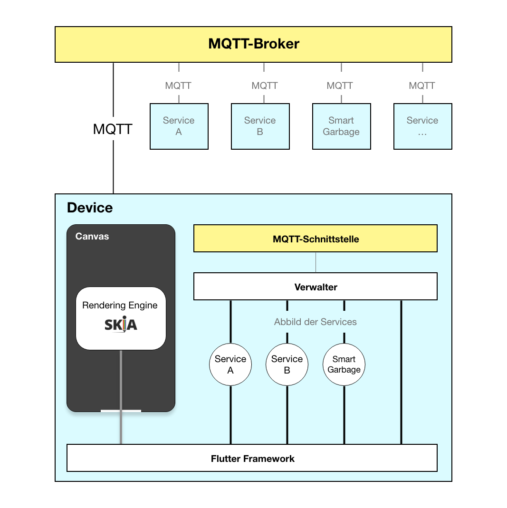
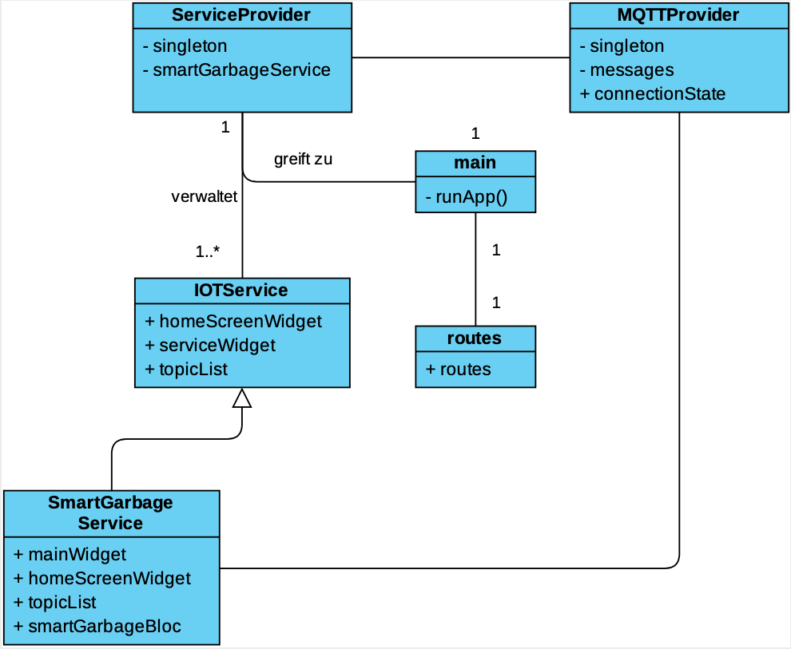
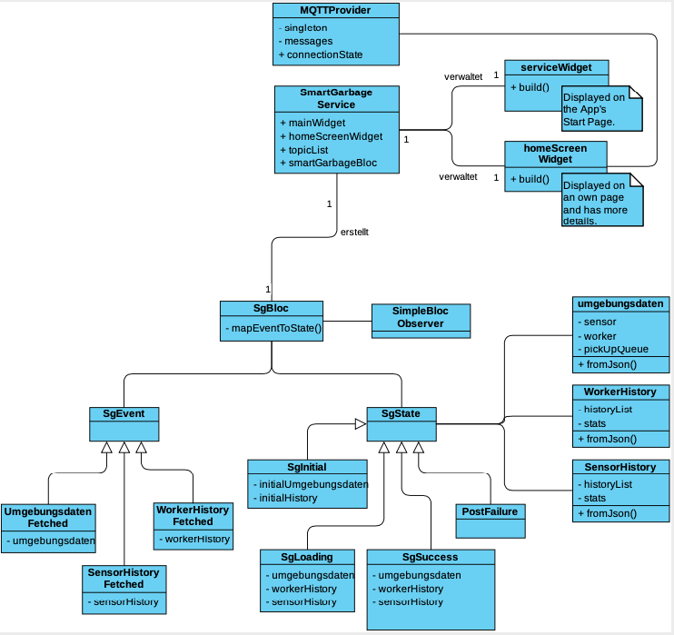

# SmartCityFrontend

</img> </img>

Im Rahmen dieses Projektes wurde ein *plattform-unabhängiges Frontend* für das SimCity Testfeld entwickelt. Dieses kombiniert die diversen Projekte unter einem einheitlichen Frontend. Dieses wurde mit  [Flutter](http://flutter.dev)  entwickelt, und ist daher auf iOS und Android lauffähig. Jedes einzelne Projekt wird als Service in das Frontend über [MQTT](https://public.dhe.ibm.com/software/dw/webservices/ws-mqtt/mqtt-v3r1.html) eingebunden. Beliebig viele solcher Services können ergänzt werden. Die Anwendung ist damit skalierbar. Im Rahmen der Implementierung wurde exemplarisch eine Umsetzung des GarbageService umgesetzt. Dieser erweitert das Frontend um das Projekt Smart-Garbage.

#### Öffentliche Version
Diese Version des Projekts wurde öffentlich auf Github zur Verfügung gestellt. Dabei wurden etwaige Passwörter unkenntlich gemacht.

## Architektur

#### Use Cases / User Stories

Das Projekt erfüllt die selben Use-Cases, wie auch Smart-Garbage selbst. Hierzu gehören

+ Worker und Sensor-Status einsehen
+ Worker pausieren / fortsetzen
+ Vergangene Tätigkeiten des Workers einsehen
+ Statistiken des Sensor-Status einsehen

Zusätzlich wurden weitere Anforderungen gestellt:

+ Einsehen aller empfangenen MQTT-Nachrichten sortiert nach Topic.


#### Lösungsstrategie



Die grundsätzlichen Abläufe des Garbage-Service sind dessen [Readme](https://github.com/htw-saar/SmartCityGarbageService/blob/master/README.md) zu entnehmen.


#### Glossar
+ *Service*: Baustein der Lösung, welche die funktionalen Anforderungen eines SmartCity Projektes innerhalb des Frontends umsetzt.
+ *Provider*: Stellt Daten asynchron einer anderen Komponenten des Systems zur Verfügung. 


#### Beschreibung wichtiger Designentscheidungen

Die Awendung nutzt das sogenannte Bloc-Muster. Details zu diesem können in der [offiziellen Dokumentation](https://bloclibrary.dev/#/coreconcepts)  nachgelesen werden.

Um die Erweiterung der Anwendung zu gewährleisten, wurde ein *MQTTProvider* und ein *ServiceProvider* erstellt. Ersterer bildet einen Wrapper um den [mqtt_client](https://pub.dev/packages/mqtt_client) und speichert Empfangene Nachrichten in einem Cubit ab. Es existiert keine Persistierung der Daten. Jeder App-Neustart fängt mit einem leeren [Cubit](https://bloclibrary.dev/#/coreconcepts?id=cubit) an. 

Der ServiceProvider verwaltet eine Menge an Services. Empfangene Nachrichten werden zunächst an den ServiceProvider weitergeleitet, welcher diese erneut zu den Services weiterleitet. Jeder Service spezifiziert hierfür eine Menge an relevanter Topics und erhält alle passenden Nachrichten. 

Anschließend verwaltet jeder Service einen eigenen [Bloc](https://bloclibrary.dev/#/coreconcepts?id=bloc). Ein *HomeScreen-Widget* und ein *Main-Widget* reagieren auf den State und zeigen aktuelle Informationen an. Die Widgets können über den MQTTProvider neue Nachrichten veröffentlichen.


#### Statisches Modell

Aufbau des allgemeinen SimCity Frontends. 




###### Garbage Service

Aufbau des GarbageService als konkrete Implementierung eines IoTService.




###### API

**Verwendete MQTT Topics:**

- Cozmo aktivieren / deaktivieren (*Frontend -> Server Backend*): `data/Gruppe4/cozmo/active`  

- Sensor prioritisieren (*Frontend -> Server Backend*):

   `data/Gruppe4/prioritise_sensor`  

- Umgebungsdaten an Frontend senden (*Server Backend -> Frontend*): `data/Gruppe4/frontend/daten`  

- Worker-History an Frontend senden (*Server Backend -> Frontend*): `data/Gruppe4/frontend/worker_history`  

- Sensor-History an Frontend senden (*Server Backend -> Frontend*): `data/Gruppe4/frontend/sensor_history`  


## Getting Started

#### Vorraussetzungen

Um das Projekt auszuführen, muss zunächst Flutter auf dem System installiert werden. 
Die [Flutter Dokumentation](https://flutter.dev/docs/get-started/install) bietet hierfür eine ausgezeichnete Dokumentation.

Ist Flutter installiert kann die Anwendung über Android Studio, Visual Studio Code (mit dem Flutter Plugin) oder über die Konsole ausgeführt werden.

Zunächst muss ein passendes Gerät angeschlossen sein. Dies kann ein angeschlossenes Android / iOS Gerät sein oder ein passender Simulator sein. Dieser sollte mit 

````
 flutter devices
````

in einer Liste angezeigt werden. Ist dies der Fall kann müssen mit 

```
pub get
```

alle benötigten Dependecys installiert werden. Ist dies geschehen, kann mit

```
flutter run
```

die App gestartet werden.

Für den Umgang mit den Editoren oder Funktion wie 'Hot-Reload' sollte die offizielle [Flutter Dokumentation](https://flutter.dev/docs/get-started/install)  konsultiert werden.


### Built With

* [Flutter](flutter.dev) - Flutter Framework
* [mqtt_client](https://pub.dev/packages/mqtt_client) - Flutter MQTT-Paket
* [Bloc-Libary](https://bloclibrary.dev/#/) - Flutter Bloc-Paket mit vorgefertigten Widgets, welche bei der Implementierung des Bloc-Musters helfen.
* [charts_flutter](https://pub.dev/packages/charts_flutter) - Data-Visualisierungs Paket geschrieben in Dart.
* [curved_navigationbar](https://pub.dev/packages/curved_navigation_bar) - Curved-Navigationbar Flutter Widget
* [google_fonts](https://pub.dev/packages/google_fonts) - Ermöglicht einfachen Zugriff auf die 977 Google Fonts mit Flutter
* [pretty_json](https://pub.dev/packages/pretty_json) - Formartiert Strings für eine gute Lesbarkeit von JSON


## License

This project is licensed under the GNU General Public License v3.0

## Acknowledgments

* Eschtzeit
